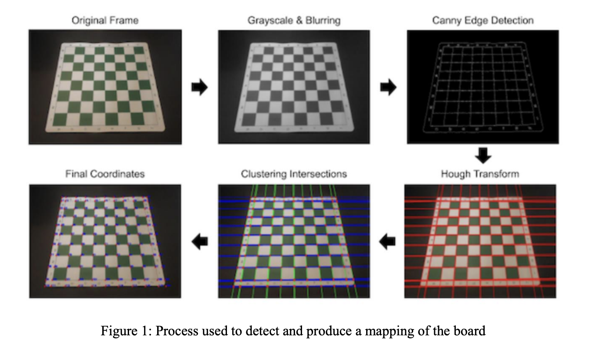
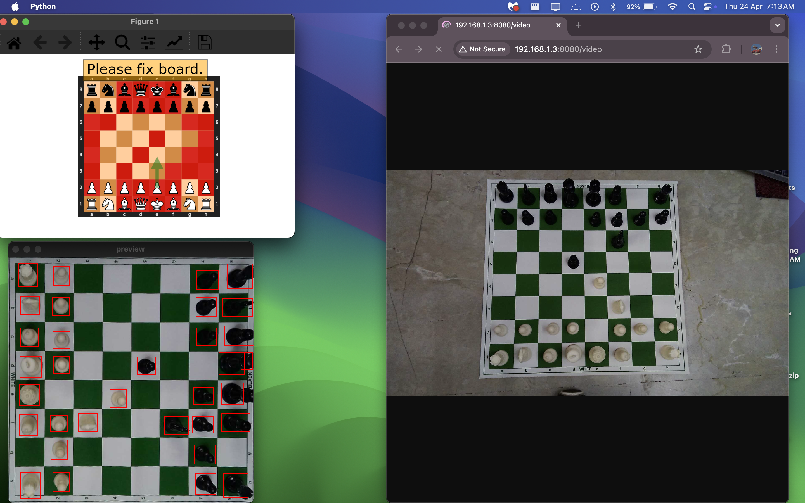

# Chess Recognition System

A computer vision-based chess recognition system that can detect and track chess pieces on a physical chessboard using a camera. The system uses computer vision and machine learning to identify chess pieces and their positions, enabling automated chess game tracking and analysis.

## Features

- Real-time chess piece detection and tracking
- Support for different board orientations
- Camera calibration and board mapping
- GUI interface for game visualization
- Integration with chess engines for move validation
- Support for both standard and custom board configurations

## Project Structure

```
chess_recognition/
├── assets/                 # Static assets and resources
│   ├── dnn/               # Deep learning model files
│   └── images/            # Documentation images
├── src/                    # Source code
│   ├── model/             # Core game logic and models
│   │   ├── game.py        # Main game implementation
│   │   ├── board.py       # Chess board representation
│   │   ├── piece.py       # Chess piece definitions
│   │   ├── camera.py      # Camera interface
│   │   ├── darknet.py     # YOLO model integration
│   │   └── gui.py         # Graphical user interface
│   ├── utils/             # Utility functions
│   ├── enumeration/       # Enumerations and constants
│   └── main.py           # Application entry point
├── requirements.txt       # Python dependencies
└── chessboard-mapping.json # Board calibration data
```

## Visual Guide


### Board Mapping

*Board mapping process showing detected squares and pieces*

### Game Interface

*Main game interface showing piece detection and move tracking*


## Prerequisites

- Python 3.8 or higher
- OpenCV
- PyQt5
- YOLO model for piece detection
- Webcam or camera device

## Installation

1. Clone the repository:
```bash
git clone https://github.com/shubhsardana29/chess_recognition-system.git
cd chess_recognition-system
```

2. Create and activate a virtual environment:
```bash
python -m venv venv
source venv/bin/activate  # On Windows: venv\Scripts\activate
```

3. Install dependencies:
```bash
pip install -r requirements.txt
```

## Usage

The system can be run in two modes:

1. Board Mapping Mode:
```bash
python src/main.py --mapping
```
This mode allows you to calibrate the camera and map the chessboard.

2. Game Mode:
```bash
python src/main.py --start
```
This mode starts the actual chess game with piece detection and tracking.

During game mode, you'll be prompted to:
- Choose whether to use padding
- Select the board orientation (White pieces position)

## Configuration

The system can be configured through various parameters:
- Board orientation (White pieces position)
- Camera settings
- Detection confidence thresholds
- GUI preferences

## Dependencies

Key dependencies include:
- OpenCV for computer vision
- PyQt5 for GUI
- YOLO for object detection
- Python-chess for chess logic
- NumPy for numerical operations

## Contributing

Contributions are welcome! Please feel free to submit a Pull Request.


## License

This project is licensed under the MIT License - see the LICENSE file for details.

## Acknowledgments

- YOLO object detection model
- OpenCV community
- Python-chess library
